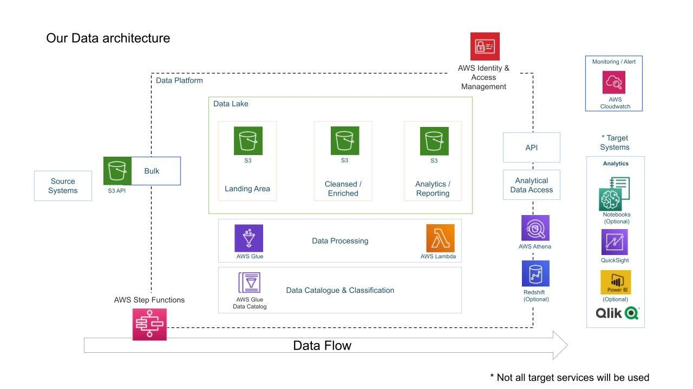

# youtube_pipeline_end_toend

# Data Engineering YouTube Analysis

## Overview

This project aims to ensure secure management, efficient organization, and in-depth analysis of structured and semi-structured data from YouTube videos. The focus lies on video categories and trending metrics, allowing for streamlined processing and enhanced insights.

## Project Goals
1. Data Ingestion - Establish a mechanism for acquiring data from various origins.
2. Cloud - Given the limitations of local computing power, leveraging cloud infrastructure, specifically AWS, becomes necessary to process extensive datasets.
3. Data lake —  Due to the multiple data sources, a centralized repository is required to store the acquired data.
4. ETL System - The data is received in its raw form and subsequently transformed into the appropriate format.
5. Scalability —  Ensuring the system's ability to expand alongside the increasing data volume.
6. Reporting — Develop a dashboard that provides insights and answers to the previously posed inquiries.

## Services we will be using
1. AWS IAM: AWS IAM (Identity and Access Management) offers a reliable means to securely manage access to AWS resources and services.
2. Amazon S3: Amazon S3 serves as a flexible and secure object storage solution, delivering scalability, data availability, performance, and robust security measures.
3. QuickSight: QuickSight, an advanced cloud-based business intelligence (BI) service, utilizes machine learning capabilities, ensuring scalability, serverless operation, and the ability to embed it seamlessly.
4. AWS Lambda: Lambda, an event-driven computing service, empowers developers to execute code without the need for server management or provisioning.
5. AWS Athena: Athena serves as an interactive query service designed for S3, eliminating the need to load data into a separate system as it remains stored in S3.
6. AWS Glue: AWS Glue, a serverless data integration service, simplifies the process of discovering, preparing, and merging data for analytics, machine learning, and application development purposes.

## Dataset Used
This Kaggle dataset contains statistics (CSV files) on daily popular YouTube videos over the course of many months. There are up to 200 trending videos published every day for many locations. The data for each region is in its own file. The video title, channel title, publication time, tags, views, likes and dislikes, description, and comment count are among the items included in the data. A category_id field, which differs by area, is also included in the JSON file linked to the region.

https://www.kaggle.com/datasets/datasnaek/youtube-new

## Architecture Diagram

## QuickSight Dashboard

